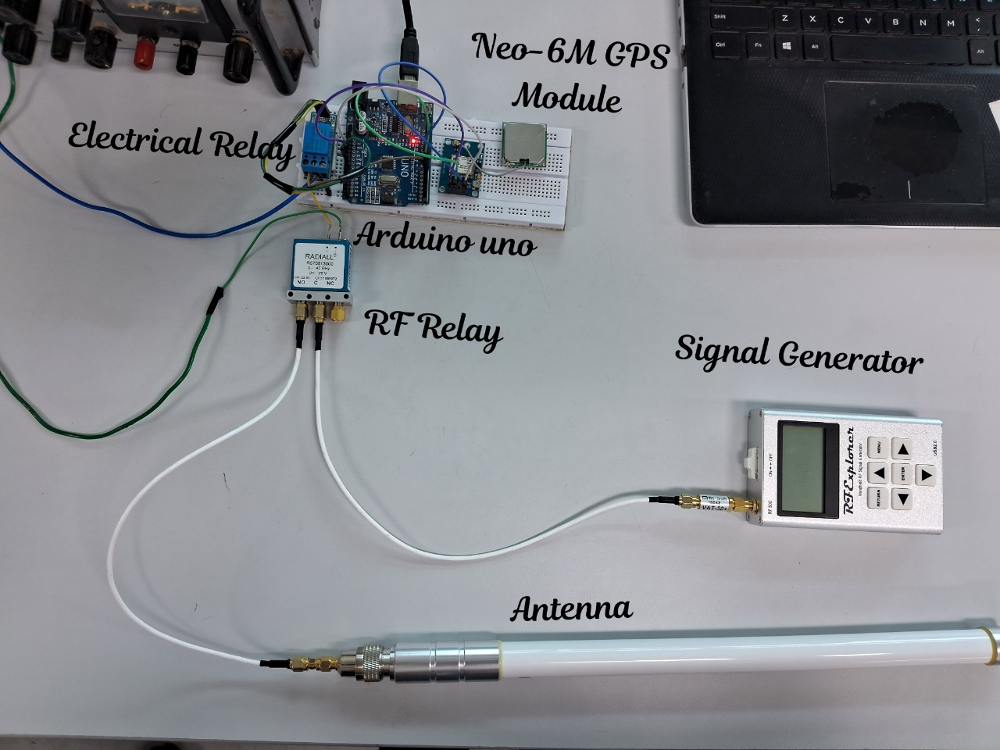

## ***The Morse Code Theory*** 
### ***( GPS-Integrated Emergency Beacon Using OOK Modulation and SDR Reception With RF Signal generator )***

### *Tech behind it :* <br>
A *Signal Generator that generates Carrier Signal . A Hardware-based OOK is performed by a RF Coaxial Switch and we control it's logic by a Microcontroller which creates a OOK Modulation*
<pre>
Components Used :
* Signal Generator        - RF Explorer 
* RF Coaxial switch       - Radiall R570413100
* Electrical relay        - Songle SRD-05VDC-SL-C relay
* GPS Module              - NEO 6M GPS module
* Software Defined Radio  - BladeRF micro 2.0 xA4
* Microcontroller         - Arduino UNO 
</pre>



### ***How It Works :*** <br>
1. ***Carrier Generation***  <br>
   A signal generator produces a continuous RF carrier signal. <br>
2. ***OOK Modulation***  <br>
   A RF coaxial switch turns the carrier **ON and OFF**, implementing Morse code. <br>
3. ***Microcontroller Control***  <br>
   An Arduino controls the RF switch timing to generate Morse symbols. <br>
4. ***GPS Encoding***  <br>
   The GPS module provides latitude and longitude, which are encoded into Morse format. <br>
5. ***Transmission Format*** <br>
```
SOS ... --- ... 
+
GPS <Latitude> <Longitude>
```
Example:
```
.---- ..--- .-.-.- ----. --... .---- -.... / -. / --... --... .-.-.- ..... ----. ....- -.... / [12.9716 N 77.5946 E] (Coordinates converted into morse code)
```
6. **Reception**  
   The RF signal is captured using a **BladeRF SDR**, allowing waveform observation and decoding.

### ***Pin Configuration :***
 <br>
### *Demo :* <br>
[Watch This Video](https://youtu.be/Z5Ts6uCkag4)
